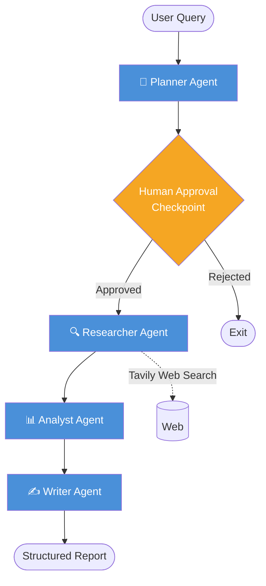

# AgentFlow 🤖

A **multi-agent research assistant** built with LangGraph and LangChain. Given any query, AgentFlow orchestrates a pipeline of specialised agents to plan, research, analyse, and write a comprehensive structured report.

---

## Architecture



### Agent Roles

| Agent | Role |
|---|---|
| **Planner** | Breaks the query into 3-5 focused research sub-tasks |
| **Human Checkpoint** | Reviews the plan before any web searches are made |
| **Researcher** | Runs Tavily web search for each sub-task, returns structured results |
| **Analyst** | Synthesizes findings — identifies patterns, gaps, and key insights |
| **Writer** | Produces a final Markdown report with citations |

---

## What This Demonstrates

- **Multi-agent orchestration** with LangGraph stateful graph
- **Tool use** — Tavily web search integrated as a callable tool
- **Human-in-the-loop** checkpointing before autonomous execution
- **Typed state management** with TypedDict across agent transitions
- **Modular, production-ready Python** — each agent is independently testable
- **Graceful error handling** — search failures don't crash the pipeline

---

## Quick Start

### 1. Clone and install

```bash
git clone https://github.com/AsheryMbilinyi/agentflow.git
cd agentflow
pip install -r requirements.txt
```

### 2. Set up API keys

```bash
cp .env.example .env
# Add your OPENAI_API_KEY and TAVILY_API_KEY
```

Get a free Tavily API key at [tavily.com](https://tavily.com) (1000 free searches/month).

### 3. Run

```bash
# With human approval checkpoint (default)
python main.py --query "What are the key trends in agentic AI for enterprise in 2025?"

# Skip approval (fully autonomous)
python main.py --query "Your query here" --auto
```

---

## Example Output

See [`examples/sample_output.md`](examples/sample_output.md) for a pre-run example — no API keys required to view.

---

## Project Structure

```
agentflow/
├── main.py                 # Entry point — CLI interface
├── requirements.txt
├── .env.example
├── agents/
│   ├── planner.py          # Breaks query into sub-tasks
│   ├── researcher.py       # Web search per sub-task
│   ├── analyst.py          # Synthesizes findings
│   └── writer.py           # Produces final report
├── graph/
│   └── workflow.py         # LangGraph state machine
└── examples/
    └── sample_output.md    # Pre-run output (no API key needed)
```

---

## Extending AgentFlow

AgentFlow is designed to be modular. Some ideas:

- **Add a Fact-Checker agent** between Analyst and Writer
- **Swap Tavily for internal tools** — connect to your company's knowledge base or APIs
- **Add memory** — use LangGraph's `MemorySaver` for multi-turn conversations
- **Add streaming** — stream agent outputs token by token to a Streamlit UI
- **Replace OpenAI** — swap `ChatOpenAI` for `ChatAnthropic` or a local Ollama model

---

## Tech Stack

- [LangGraph](https://langchain-ai.github.io/langgraph/) — agent orchestration
- [LangChain](https://langchain.com) — LLM interface and tooling
- [Tavily](https://tavily.com) — web search API optimised for LLMs
- [Rich](https://rich.readthedocs.io) — terminal formatting
- OpenAI `gpt-4o-mini` — fast, cost-effective LLM

---

## Author

**Ashery Mbilinyi** — ML Engineer & Researcher | Assistant Professor @ UVic | PhD, Computer Science
[LinkedIn](https://linkedin.com/in/asherymbilinyi) · [GitHub](https://github.com/AsheryMbilinyi) · [Website](https://asherymbilinyi.github.io)
